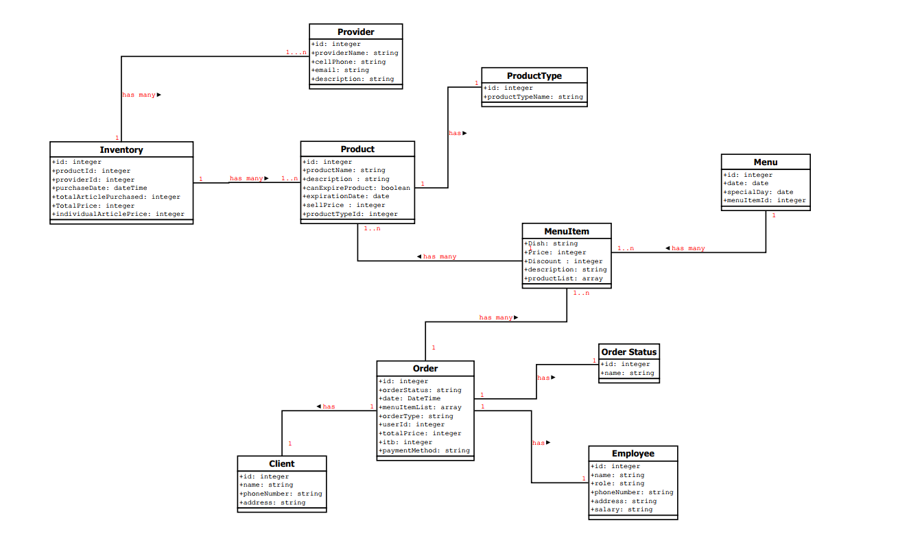

# The Good Taste

## Conceptual Scope

The Good Taste is a hybrid project (web/mobile) of a Dominican restaurant, an app that simulates a real restaurant, will be able to reserve tables or carry out delivery processes, process orders simultaneously, make payments through different ways, provide the status of the order, send notifications of the dish of the day to users who want said service, show the menu of the day and others.

The app will manage inventories and keep a record of suppliers.

## Main Language

- JavaScript

## Project Structure

 

